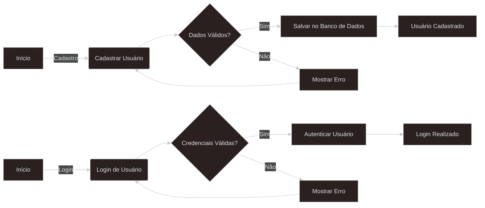

# Pagina-de-Vendas
Devera conter área de cadastro utilizando banco de dados MySQL

### [DIAGRAMA](https://www.mermaidchart.com/raw/e2f85f5d-d5be-4453-a3c4-1f2a943c2272?theme=dark&version=v0.1&format=svg)
